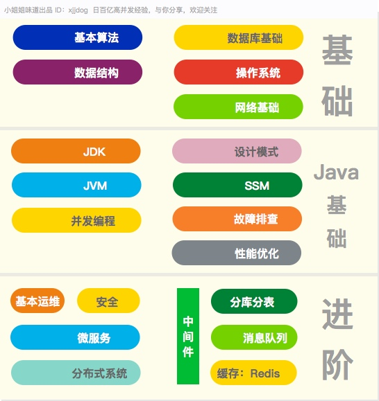
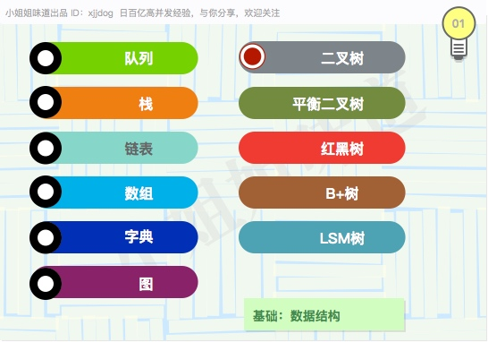
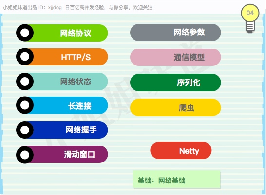
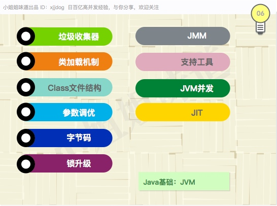
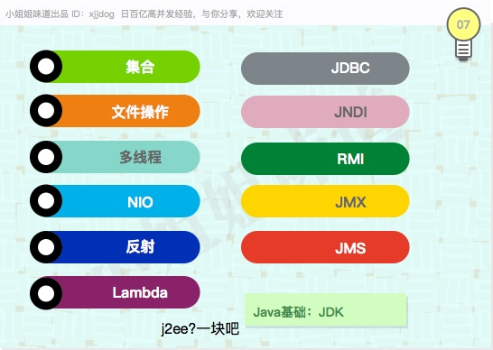
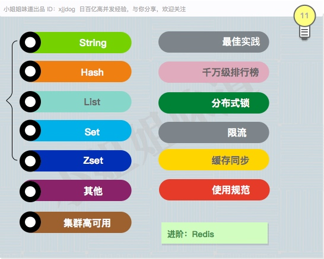
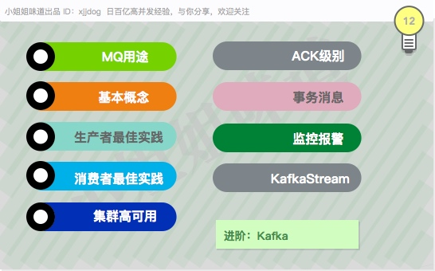
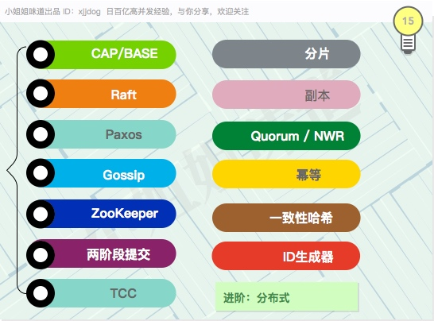

# 必看！java后端，亮剑诛仙

# 持续更新中，赶紧star吧（一天一篇精选，365足以）


你可能有所感悟。零散的资料读了很多，但是很难有提升。到处是干货，但是并没什么用，简单来说就是缺乏系统化。另外，噪音太多，雷同的框架一大把，我不至于全都要去学了吧。

这里，我大体根据基础、Java基础、Java进阶给分了下类，挑的也都是最常用最重要的工具。



这篇文章耗费了我大量的精力，你要是觉得好，请不要吝啬你的赞。如果你认同，可以关注我的微信公众号xjjdog，里面讲的就是这些内容。我会尝试更加系统化。

最新的内容会在github持续更新，添加新的精选相关文章。地址：
```
https://github.com/sayhiai/javaok
```

# 基础知识

## 数据结构

基本的数据结构是非常重要的，无论接触什么编程语言，这些基本数据结构都是首先要掌握的。具体的实现，就体现在java的集合类中。这些数据结构，就是这些复杂工具的具体原始形态，要烂记于心。

培训机构一般没有时间普及基础知识，通过算法和数据结构，“通常”能够一眼看出是否是经过培训。




## 常用算法

算法是某些大厂的门槛。毫无疑问，某些参加过ACM的应届生，能够秒杀大多数工作多年的码农。算法能够培养逻辑思维能力和动手能力，在刚参加工作的前几年，是非常大的加分项。但随着工作年限的增加，它的比重在能力体系中的比重，会慢慢降低。

算法的学习方式就是通过不断的练习与重复。不精此道的同学，永远不要试图解决一个没见过的问题。一些问题的最优解，可能耗费了某个博士毕生的精力，你需要的就是理解记忆以及举一反三。最快的进阶途径就是刷leetcode。

对于普通研发，排序算法和时间复杂度是必须要掌握的，也是工作和面试中最常用的。时间充裕，也可涉猎动态规划、背包等较高阶的算法知识，就是下图的左列。


  
### 书籍

《算法导论》  有人质疑这本书读不下去，这真是太可惜了。  
《编程之美》  
《数学之美》  
《编程珠玑》

#### 相关资源

[CSDN极丰富算法资源](https://blog.csdn.net/v_JULY_v)  


## 数据库基础 MySQL

MySQL是应用最广的关系型数据库。除了了解基本的使用和建模，一些稍底层的知识也是必要的。

MySQL有存储引擎的区别。InnoDB和MyISAM是最常用的，优缺点应该明晓。ACID是关系型数据库的基本属性，需要了解背后的事务隔离级别。脏读、幻读问题的产生原因也要了解。

为了加快查询速度，索引是数据库中非常重要的一个结构，B+树是最常用的索引结构。因字符集的问题，乱码问题也是经常被提及的。

专业的DBA通常能帮你解决一些规范和性能问题，但并不总是有DBA，很多事情需要后端自己动手。


  
### 书籍

《MySQL技术内幕——InnoDB存储引擎》  
《高性能MySQL》  
《高可用MySQL》  

### 相关资料

[MySQL索引背后的数据结构及算法原理](http://blog.codinglabs.org/articles/theory-of-mysql-index.html)


## 网络基础

网络通信是互联网时代最有魅力的一个特点，可以说我们的工作和生活，每时每刻都在和它打交道。

连接的三次握手和四次握手，至今还有很多人非常模糊。造成的后果就是对网络连接处于的状态不慎了解，程序在性能和健壮性上大打折扣。  

HTTP是使用最广泛的协议，通常都会要求对其有较深入的了解。对于Java来说，熟悉Netty开发是入门网络开发的捷径。

爬虫是网络开发中另外一个极具魅力的点，但建议使用python而不是java去做。



### 书籍

《HTTP权威指南》  
《TCP/IP详解 卷一》  

## 操作系统 Linux

科班出身的都学过《计算机组成机构》这门课，这非常重要，但很枯燥。结合Linux理解会直观的多。鉴于目前大多数服务器环境都是Linux，提前接触能够相辅相成。

需要搞清楚CPU、内存、网络、I/O设备之间的交互和速度差别。对于计算密集型应用，就需要关注程序执行的效率；对于I/O密集型，要关注进程（线程）之间的切换以及I/O设备的优化以及调度。这部分知识是开发一些高性能高可靠中间件的前提，无法绕过。

对于Linux，首先应该掌握的就是日常运维，包括常用命令的使用和软件安装配置。正则也是必须要掌握的一个知识点。

脚本编程对后端来说是一个非常大的加分项。它不仅能增加开发效率，也能在一些突发问题上使你游刃有余。


### 书籍 

《UNIX环境高级编程（第3版）》  
《鸟哥的Linux私房菜》  
《Linux内核设计与实现》  
《Linux命令行大全》  

### 相关文章

[《Linux上，最常用的一批命令解析（10年精选）》](https://mp.weixin.qq.com/s/9RbTGQ4k4s92mrSf2xJ5TQ)

# Java基础

## JVM

Java程序员的最爱和噩梦。以oracle版本为准，各个jvm版本之间有差别。JVM的知识包含两方面。一个是存储级别的，一个是执行级别的。

以存储为例，又分为堆内的和堆外的两种，各有千秋。垃圾回收器就是针对堆内内存设计的，目前最常用的有CMS和G1。JVM有非常丰富的配置参数来控制这个过程。在字节码层面，会有锁升级以及内存屏障一类的知识，并通过JIT编译来增加执行速度。

JVM还有一个内存模型JMM，用来协调多线程的并发访问。JVM的spec非常庞大，但面试经常提及。

另外，jdk还提供了一系列工具来窥探这些信息。包含jstat，jmap，jstack，jvisualvm等，都是最常用的。



### 书籍

《深入理解Java虚拟机》  

### 相关资源

[求你了，再问你Java内存模型的时候别再给我讲堆栈方法区了…](https://mp.weixin.qq.com/s/uTmc-dLwPG_t0SMZGKMfQg)  

## JDK

现在，终于到了java程序员的核心了：JDK，一套依据jvm规范实现的一套API。我们平常的工作，就是组合这些API，来控制程序的行为。

jdk的代码非常庞大，内容也非常繁杂。最重要的大体包括：集合、多线程、NIO、反射、文件操作、Lambda语法等。这部分内容加上下面的SSM，基本上就是大多数小伙伴玩耍的地方。

假如说数据结构和算法是理论，这里就是支撑理论的实现。Java玩的好不好，就是说这里。



### 书籍

《Effective Java 中文版》  
《数据结构与算法分析：Java语言描述》  

### 相关文章

[疫苗：JAVA HASHMAP的死循环](https://coolshell.cn/articles/9606.html)  
[Java 编程思想](https://java.quanke.name/) 初级java编程  
[浅谈 Java 内存模型](http://www.linkedkeeper.com/1502.html) JMM  

## SSM

你可能会用SSM开发项目，觉得编程无非就这些东西。设计模式烂记于心，IOC、AOP手到擒来。这里集中了大部分同行，有些可能到此为止就Ok了，因为有些同学接下来的重点是项目管理，而不是技术。

SSM最擅长的是Web开发。目前的表现形式逐渐多样化，随着前后端分离的盛行，Restful这种有着明确语义的模式逐渐流行。


### 书籍

《Head First 设计模式》  
《Spring揭秘》  
《SpringBoot揭秘》  
《MyBatis技术内幕》  
《深入剖析Tomcat》  

其实跟着文档走一遍就行了，很多书籍就是翻译而已。

### 相关文章

[MyBatis中文文档](http://www.mybatis.org/mybatis-3/zh/index.html)

## 并发编程

现在的服务器都是多核的了，并发编程也来越多。java有多种创建多线程的方式，不过目前使用线程池的多一些。线程池的基础就是AQS，基于AQS，又有很多的工具类扩展。

java同时有很多加锁和线程同步的方式，锁有乐观锁/悲观锁之分，又有公平锁/非公平锁之分，写一段死锁代码还是有点难度的。 

有两个问题被考察的频率非常高，一个是ABA，一个是伪共享。并发编程一般和网络编程配对，提供对某个问题的一系列解决方案。

这是java中一块难啃的骨头。


### 书籍

 《Java核心技术系列：Java多线程编程核心技术》  
 《Java性能权威指南》  
《Java并发编程实战》  
 
## 性能优化 & 故障排查

有人认为这应该是SRE的范畴，但通常最熟悉业务的却是开发，技术并没有什么明显的界限。掌握这些内容，会让你在芸芸大众中脱颖而出。

从操作系统的内核优化到数据库的索引和事务优化，这部分的技能是建立在牢固的基础之上的。也就是操作系统的基础。

操作系统的每个组件都有可能出现问题，对于一个java后端来说，要能够非常容易的定位到这些问题。比如常见的内存溢出问题。


### 书籍

《性能之巅：洞悉系统、企业与云计算》  
《高性能Linux服务器构建实战》  

# Java进阶

下面有些知识点，界限是非常模糊的。它们你中有我，我中有你，可以说是一个整体。

## Redis

缓存可以说是计算机系统中应用最广泛的技术了。对于分布式缓存来说，最常用的就是Redis了。由于其数据结构丰富，被应用的场景越来越多。

基本的5种数据类型都知道，但你要说出其他几种，给人的印象就不一样了。Redis有主从和Cluster两种集群模式，高可用配置也不相同。

Redis几乎能适应除搜索外的所有互联网业务，对于其使用来说，一些规范限制是非常有必要的。一般速度越快的系统，越容易被长尾操作给拖死。所以，对于`info`命令的内容，也应有了解。

有三个点要尤其注意：分布式锁、限流，以及和源数据的同步问题。


### 书籍

《Redis实战 》  
《Redis开发与运维》  
《Redis设计与实现》  

### 相关文章

[《这可能是最中肯的Redis规范了》](https://mp.weixin.qq.com/s/5EH4-isDFxkGAXTWEhrZ-w)  
[《与亲生的Redis Cluster，来一次亲密接触》](https://mp.weixin.qq.com/s/_sQAxId7yoqyXhy3bENMNw)

## Kafka

MQ是分布式系统中非常重要的组件，目前使用最广泛的就是Kafka。除了用在大数据场景中，Kafka也能够在业务系统中使用。

Kafka的速度非常快，根据ACK的级别配置，可靠性会增加，但速度会减缓。对于消息系统来说，监控报警是非常重要的一环，能够提前预知系统的问题。Kafka的集群自身就是高可用的，依赖Zookeeper组件，了解一些基本概念，包括ISR，能够更加详细的了解这个过程。



### 书籍

《Kafka入门与实践》  
《Kafka技术内幕》  

### 相关文章

[《Kafka基础知识索引》](https://mp.weixin.qq.com/s/MKiFehA4EHTv1o23A28Jyg)  
[《Kafka教程集合 by半兽人》](https://www.orchome.com/kafka/index)

## 分库分表 ShardingJDBC

随着数据的增长，MySQL本身出现了瓶颈。分库分表是针对关系型数据库的一套解决方案，把它改造成分布式数据库。

根据切分层次，最像回事的是在代理层和驱动层进行切入。ShardingJDBC就是在驱动层的一个组件。  

组件本身只是一个问题。在真正的切分之前，会有垂直拆分和水平拆分之分。我们的线上业务也要不停机的进行拆分和切换，一个全量和增量同步工具都是需要的。

有条件经历这个过程的，都是一笔宝贵的财富。它不仅在技术上，而且在流程上都有诸多挑战。你会体验到技术、流程、管理，是不分家的。


### 相关文章

[“分库分表" ？选型和流程要慎重，否则会失控](https://mp.weixin.qq.com/s/U_pEF9sfnXeZ7RnhGFnqyg)  
[非规范SQL的sharding-jdbc实践](https://mp.weixin.qq.com/s/YaDiIieHpBCCuVraBQv6jg) 最新功能以apache版本为主  
[数据库中间件详解](https://mp.weixin.qq.com/s?__biz=MzA5MDA5Njk0NQ==&mid=2456618601&idx=1&sn=c10839f1797e7be1ea41f005b57432df&chksm=87897237b0fefb215dd74c28cf5b524984b8f50d2ef13293e37919774f1c51e36642e489ee38&token=936375027&lang=zh_CN#rd)


## 微服务 & 中间件

目前最火的微服务架构就是SpringCloud。这对熟悉SSM开发的同学来说， 是非常容易上手的。微服务有注册中心、RPC、负载均衡、熔断限流、网关等关键组件，有些组件有很多不同的替代品。


微服务拆分后又引申出一些列问题，需要一些其他中间件支持。比如监控报警、ELKB、配置中心、调度中心、调用链等。虽然没有微服务也需要它们，但明显组合起来，效果会好的多。 
各种A/B测试，金丝雀，灰度等，基本是终极目标之一。  
微服务是一个复杂的整体，同时融合了技术和流程管理方面的内容。

### 书籍

《可伸缩服务架构：框架与中间件》  
《Spring Cloud与Docker微服务架构实战》  
《架构修炼之道》  

### 相关资料

[这次要是讲不明白Spring Cloud核心组件，那我就白编这故事了](https://mp.weixin.qq.com/s/hjYAddJEqgg3ZWTJnPTD9g)  
[微服务不是全部，只是特定领域的子集](https://mp.weixin.qq.com/s/8DMwjNYt3WJWXmr2HPn8_w)  

## 分布式

当服务器数量增加，一些服务，包括上面提到的微服务，都需要进行协调和交互。这就是分布式系统。

分布式的理论基础有CAP、BASE等。针对一致性，有特别多的算法，其中Raft作为易懂的新贵，使用越来越广泛。

这部分侧重于理论，一旦开始进入实践，写出来的都是些大家伙。这里有一篇文章，虽然不是很全，聊表心意吧。


### 相关文章

[《也浅谈下分布式存储要点》](https://mp.weixin.qq.com/s/T-Sc0YPrPZNFHtoM4JhbZg)

### 书籍

《NoSQL精粹》  
《ZooKeeper：分布式过程协同技术详解》  
《从Paxos到Zookeeper分布式一致性原理与实践》  

# 支撑技术

## 基本运维

我倾向于基础架构和运维不分家，因为它们有太多重合和相似的地方。基本运维和架构配合起来，典型的特点就是平台化+规范化。

这里是检验综合素质的地方，有广度也有深度。  


### 相关文章

[《这么多监控组件，总有一款适合你》](https://mp.weixin.qq.com/s/rdD54-zyapjlubM5K1jUeQ)

### 书籍

《奔跑吧Ansible》  
《Docker——容器与容器云》  
《Kubernetes权威指南》  
《Jenkins权威指南》  
《深入理解Nginx》  

## 安全

安全无小事，建筑工地和系统安全一样的道理。熟悉一些常用的攻击和加密解密算法是必要的。

就像是你给家里的门上锁：能够阻挡大部分心怀不轨的人，但无法阻挡无所顾忌的暴徒。


# End

你可能发现并没有自己关注的组件。这不奇怪，比如个人喜欢的的ES，就找不到一个合适的位置。这里只是最主要的一点内容，就已显繁杂，一个大杂烩并不见得好。

值得提醒的是，这些知识，是众多发展路线上的一个分支。可能有的朋友，目前只在其中的一个点上面奋斗，缺乏所谓的广度；也可能有的朋友，有着全栈的标签，却做着SSM的工作。不同的公司需要的技术水平不尽相同。一个专注ERP业务的公司，会在项目管理上多些文章；一个专做IM的团队，可能对网络开发滚瓜烂熟。
 
 再次强调。此技术要点为个人整理，为了修复认知上的偏差，我会维护一个github项目，实时跟进分类和增加新的相关文章(欢迎提及PR)。如果你有什么想法，请尽快反馈给我，非常感谢。


